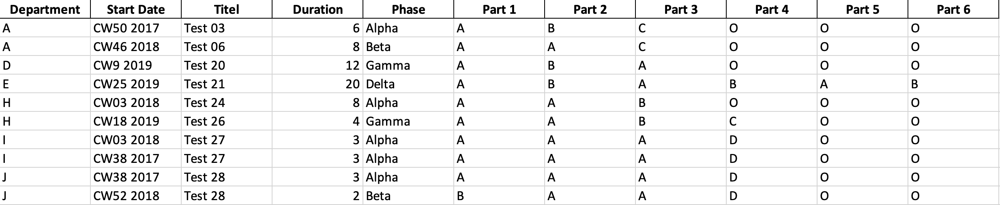
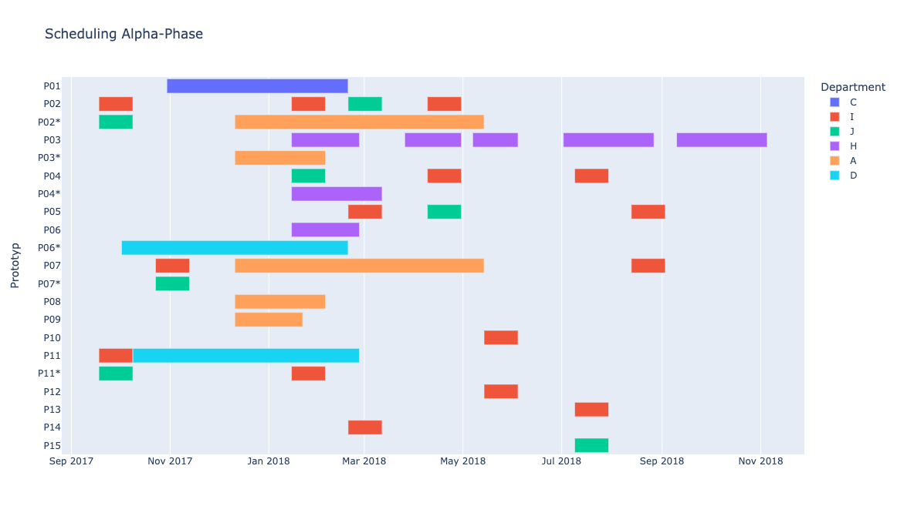

# Prototype Management

## Introduction

This is a mini, non-quantum trial for implementing an algorithm that creates prototypes and schedules tests on them out of given data.
The data is in the form of an excel file, each row specifying an order or "test" that has to be performed on a certain date with a specific kind of configuration.
While the code is currently in the form of a jupyter notebook, it can be easily converted into a normal executable python file.

The algorithm checks for shared configurations between these test and specifies prototypes accordingly. These prototypes are then scheduled using a brute-force approach (greedy scheduling), which is blunt but makes sense here, as the set starting dates and configurations of the test heavily reduce the possible solutions.
Instead of claiming to have an optimal solution, this algorithm primarily serves to create a starting point for the problem that can then be adjusted by hand later.

## Data structrure

The data has to be provided in the form of an exel file. Columns "Titel" and "Department" specify the Name of the Test and which department it need to be performed in. "Start" and
"Duration" indicate the start date of the test in the Form "CWXX YEAR", where CW is the calender week and duration is the length of the test in weeks. The "Phase" parameter is optional.

Tests with different phases will be treated indepentently with their own schedule, prototypes etc. This is for convenience only, as the same result could be achieved by using different tables.

The last columns contain the requirements for the individual test. For each group of parts that are exclusive to each other (for instance the color of a car which can be either white, black, green, blue etc. not not blue and green at the same time) a new column has to be created. For each test the requirement is denoted with a name or code (green, yellow... or A, B...). If filled out with 'O', the test does not care about this requirement and could work with any option.

An example of how this table should look can bee seen in the image below:

## Output

The notebook outputs an interactive plotly plot of the generated schedule. Each row corresponds to one of the generated prototypes. Prototypes with an "*" in their name are clones of already existing prototypes, which are necessary under certain conditions e.g. two test both require the same prototype at the same time. Scheduled test are colored by their department. Furthermore, the configuration of each prototype is printed.

An example of one of the plotted schedules can be seen below. Note that the actual plot is **interactive** with the names of the test only appearing when hovering over them.

### Credit

Marian Mularski

Alissa Wilms